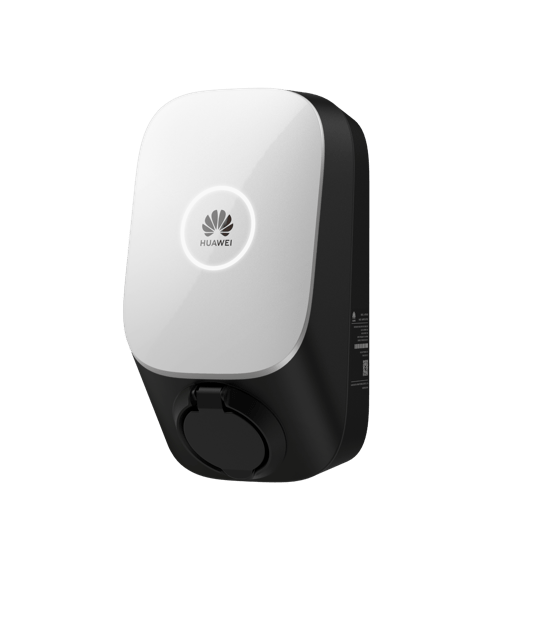

# ioBroker.huawei-charger

[](https://www.npmjs.com/package/iobroker.huawei-charger)
[](https://www.npmjs.com/package/iobroker.huawei-charger)


[](https://nodei.co/npm/iobroker.huawei-charger/)

**Tests:** 

## huawei-charger adapter for ioBroker

This adapter enables seamless integration of Huawei AC Chargers with ioBroker using the Modbus-TCP protocol. It allows real-time monitoring and control of charging parameters such as voltage, current, and power, with a user-friendly interface for configuration and logging.

## Developer manual
This section is intended for the developer. It can be deleted later.

### DISCLAIMER

Please make sure that you consider copyrights and trademarks when you use names or logos of a company and add a disclaimer to your README.
You can check other adapters for examples or ask in the developer community. Using a name or logo of a company without permission may cause legal problems for you.

### Getting started

You are almost done, only a few steps left:
1. Clone the repository from GitHub to a directory on your PC:
	```bash
	git clone https://github.com/DNAngelX/ioBroker.huawei-charger
	```

1. Head over to [main.js](main.js) and start programming!

### Best Practices
We've collected some [best practices](https://github.com/ioBroker/ioBroker.repositories#development-and-coding-best-practices) regarding ioBroker development and coding in general. If you're new to ioBroker or Node.js, you should
check them out. If you're already experienced, you should also take a look at them - you might learn something new :)

### Scripts in `package.json`
Several npm scripts are predefined for your convenience. You can run them using `npm run <scriptname>`
| Script name | Description |
|-------------|-------------|
| `build` | Compile the React sources. |
| `watch` | Compile the React sources and watch for changes. |
| `test:js` | Executes the tests you defined in `*.test.js` files. |
| `test:package` | Ensures your `package.json` and `io-package.json` are valid. |
| `test:integration` | Tests the adapter startup with an actual instance of ioBroker. |
| `test` | Performs a minimal test run on package files and your tests. |
| `check` | Performs a type-check on your code (without compiling anything). |
| `lint` | Runs `ESLint` to check your code for formatting errors and potential bugs. |
| `translate` | Translates texts in your adapter to all required languages, see [`@iobroker/adapter-dev`](https://github.com/ioBroker/adapter-dev#manage-translations) for more details. |
| `release` | Creates a new release, see [`@alcalzone/release-script`](https://github.com/AlCalzone/release-script#usage) for more details. |

### Configuring the compilation
The adapter template uses [esbuild](https://esbuild.github.io/) to compile TypeScript and/or React code. You can configure many compilation settings 
either in `tsconfig.json` or by changing options for the build tasks. These options are described in detail in the
[`@iobroker/adapter-dev` documentation](https://github.com/ioBroker/adapter-dev#compile-adapter-files).

### Writing tests
When done right, testing code is invaluable, because it gives you the 
confidence to change your code while knowing exactly if and when 
something breaks. A good read on the topic of test-driven development 
is https://hackernoon.com/introduction-to-test-driven-development-tdd-61a13bc92d92. 
Although writing tests before the code might seem strange at first, but it has very 
clear upsides.

The template provides you with basic tests for the adapter startup and package files.
It is recommended that you add your own tests into the mix.

### Publishing the adapter
Using GitHub Actions, you can enable automatic releases on npm whenever you push a new git tag that matches the form 
`v<major>.<minor>.<patch>`. We **strongly recommend** that you do. The necessary steps are described in `.github/workflows/test-and-release.yml`.

Since you installed the release script, you can create a new
release simply by calling:
```bash
npm run release
```
Additional command line options for the release script are explained in the
[release-script documentation](https://github.com/AlCalzone/release-script#command-line).

To get your adapter released in ioBroker, please refer to the documentation 
of [ioBroker.repositories](https://github.com/ioBroker/ioBroker.repositories#requirements-for-adapter-to-get-added-to-the-latest-repository).

### Test the adapter manually with dev-server
Please use `dev-server` to test and debug your adapter.

You may install and start `dev-server` by calling from your dev directory:
```bash
npm install --global @iobroker/dev-server
dev-server setup
dev-server watch
```

Please refer to the [`dev-server` documentation](https://github.com/ioBroker/dev-server#readme) for more details.

## Changelog
<!--
	Placeholder for the next version (at the beginning of the line):
	### **WORK IN PROGRESS**
-->
### 1.0.0 (2024-08-29)
* (DNAngelX) initial release

## License
MIT License

Copyright (c) 2024 DNAngelX <stolly82@web.de>

Permission is hereby granted, free of charge, to any person obtaining a copy
of this software and associated documentation files (the "Software"), to deal
in the Software without restriction, including without limitation the rights
to use, copy, modify, merge, publish, distribute, sublicense, and/or sell
copies of the Software, and to permit persons to whom the Software is
furnished to do so, subject to the following conditions:

The above copyright notice and this permission notice shall be included in all
copies or substantial portions of the Software.

THE SOFTWARE IS PROVIDED "AS IS", WITHOUT WARRANTY OF ANY KIND, EXPRESS OR
IMPLIED, INCLUDING BUT NOT LIMITED TO THE WARRANTIES OF MERCHANTABILITY,
FITNESS FOR A PARTICULAR PURPOSE AND NONINFRINGEMENT. IN NO EVENT SHALL THE
AUTHORS OR COPYRIGHT HOLDERS BE LIABLE FOR ANY CLAIM, DAMAGES OR OTHER
LIABILITY, WHETHER IN AN ACTION OF CONTRACT, TORT OR OTHERWISE, ARISING FROM,
OUT OF OR IN CONNECTION WITH THE SOFTWARE OR THE USE OR OTHER DEALINGS IN THE
SOFTWARE.